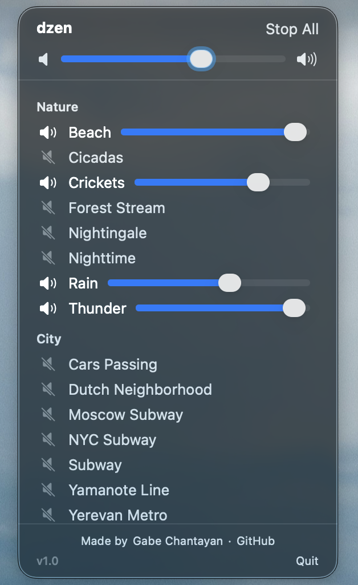

# dzen

_Background sounds for your life_

[v1](https://img.shields.io/badge/Version_1.0-oldlace) 

    

**Dzen**, from the Armenian word **ձեն** (meaning "sound") is a MacOS menu bar 
app that lets you play background sounds while you do whatever.

## Features

* Play background sounds while you do whatever
* A bunch of really cool sounds that I like
* Easy to use
* Individual volume controls
* A fifth item on this list!

## Installation

Download the [latest release](https://github.com/gabrielchantayan/dzen/releases/latest) and drag the app to your applications folder.

## FAQ

* **It says this app is unverified!1!11!** Yeah I know, I didn't feel like paying for a developer account to distribute this.
* **Can I add my own sounds?** Not atm, but [contact me](mailto:me@gabrielchantayan.com) and I'll try to fufill your request!
* **I love you, will you marry me?** Sure!
